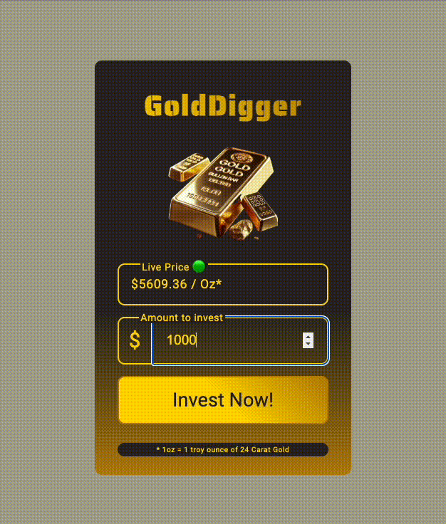

# GoldDigger - Real-Time Investment Simulator

GoldDigger is a full-stack web application that simulates a real-time gold investment platform. It showcases a modern, efficient architecture using Server-Sent Events (SSE) for live data streaming and a backend built entirely with vanilla Node.js.



## Key Features

- **Real-Time Price Updates**: Utilizes **Server-Sent Events (SSE)** to push live, simulated gold prices from the server to the client every two seconds. This provides a persistent, one-way connection that is more efficient than traditional polling for this use case.
- **Dependency-Free Backend**: The server is built from the ground up using only native **Node.js modules** (`http`, `fs/promises`, `path`), demonstrating a strong understanding of core backend concepts without relying on external frameworks like Express.
- **RESTful API Endpoint**: Features a `POST /invest` endpoint that accepts investment data, processes the transaction, and persists it to a local data store.
- **Data Persistence**: Investment transactions are saved to a `clientData.json` file, which acts as a simple, flat-file database.
- **Interactive Frontend**: The user interface is built with vanilla HTML, CSS, and JavaScript (ES Modules). It uses the `fetch` API for asynchronous POST requests and the native `<dialog>` element for a modern, accessible confirmation modal.
- **Modular Codebase**: The backend logic is organized into separate utility modules for clarity and maintainability (e.g., getting content types, simulating price data, and populating data objects).

## Tech Stack

- **Backend**:
  - Node.js
  - Server-Sent Events (SSE)
  - Native Modules: `http`, `fs/promises`, `path`
- **Frontend**:
  - HTML5
  - CSS3
  - Vanilla JavaScript (ES Modules, Fetch API, DOM Manipulation)
- **Data**:
  - JSON (used as a flat-file database)

## How It Works

1.  When a user visits the page, the client-side JavaScript establishes an `EventSource` connection to the `/gold-price-stream` endpoint on the Node.js server.
2.  The server holds this connection open and sends a new, randomly generated gold price to the client every two seconds.
3.  The user enters an investment amount and clicks the "Invest Now!" button.
4.  A `fetch` request with the `POST` method is sent to the `/invest` endpoint, containing the investment amount and the current price of gold.
5.  The Node.js server receives the request, creates a new transaction object (with a unique UUID and timestamp), and appends it to the `clientData.json` file.
6.  The server sends a `200 OK` response back to the client, including the details of the completed transaction.
7.  The frontend receives the successful response and displays a summary of the purchase in a confirmation dialog.

## How to Run Locally

To run this project on your local machine, follow these steps:

1.  **Clone the repository:**
    ```sh
    git clone <your-repository-url>
    cd <your-repository-name>
    ```

2.  **Install dependencies (if any):**
    This project uses `uuid`, so you will need to install it.
    ```sh
    npm install
    ```

3.  **Start the server:**
    The server is configured to run using `npm start`.
    ```sh
    npm start
    ```
    *This will likely execute `node server.js`.*

4.  **Open in your browser:**
    Navigate to `http://localhost:8000` in your web browser.