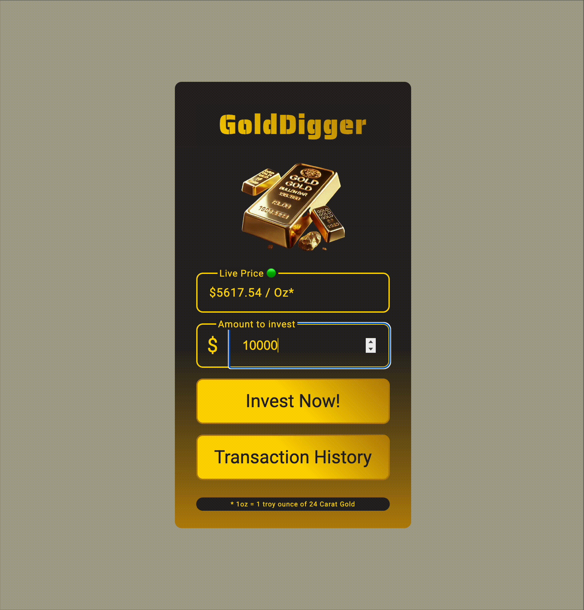

# GoldDigger: A Real-Time Investment Simulator

GoldDigger is a full-stack web application designed to simulate investing in gold. It features a live-updating gold price ticker and allows users to make mock investments, which are then recorded in a transaction history. This project serves as a practical demonstration of building a real-time, interactive application using core web technologies.

**Live Demo:** [https://gold-digger-x6dt.onrender.com/](https://gold-digger-x6dt.onrender.com/)

---



## Features

*   **Live Price Ticker:** Displays a gold price that updates in real-time without needing to refresh the page.
*   **Investment Simulation:** Users can enter a dollar amount to "invest" at the current market price.
*   **Transaction Persistence:** All investment transactions are saved on the server.
*   **Transaction History:** Users can view a complete, chronologically sorted list of all past investments.
*   **Responsive UI:** A clean and straightforward interface built with semantic HTML and modern CSS.
*   **Connection Status Indicator:** Visually informs the user if the connection to the live price stream is active or disconnected.

## Technical Stack & Core Concepts

This project was built from the ground up to showcase a strong understanding of fundamental web development principles.

### Backend

*   **Node.js:** The runtime environment for the server.
*   **Native Node.js `http` Module:** The server is built using the core `http` module, demonstrating an understanding of Node.js fundamentals without reliance on a framework like Express.
*   **Server-Sent Events (SSE):** The live gold price is streamed from the server to the client using SSE. This provides a lightweight, efficient one-way channel for real-time data updates.
*   **File-Based Data Persistence:** The backend uses Node's `fs/promises` module to read from and write to a JSON file, acting as a simple database for transaction history.
*   **RESTful API Endpoints:** The server handles `GET` requests for static assets and transaction data, and `POST` requests for submitting new investments.

### Frontend

*   **Vanilla JavaScript (ES Modules):** All client-side logic is written in modern, dependency-free JavaScript.
*   **`EventSource` API:** The client subscribes to the backend's SSE stream using the native `EventSource` interface to receive live price data.
*   **Fetch API:** Asynchronous `POST` and `GET` requests are handled using the `fetch` API with `async/await` for clean, modern code.
*   **Dynamic DOM Manipulation:** The transaction history and investment summaries are dynamically generated and injected into the DOM.
*   **Semantic HTML & Accessibility:** The application utilizes semantic tags (`<main>`, `<section>`, `<dialog>`) and ARIA attributes to ensure a good user experience and accessibility.

## How It Works

1.  **Connection:** When a user visits the page, the frontend establishes an `EventSource` connection to the `/gold-price-stream` endpoint on the Node.js server.
2.  **Real-Time Data Stream:** The server uses `setInterval` to periodically send a new (simulated) gold price to the client over the SSE connection. The client listens for these events and updates the price display in real-time.
3.  **Making an Investment:**
    *   The user enters an amount and clicks "Invest Now!".
    *   The frontend sends a `POST` request to the `/invest` endpoint, including the investment amount and the current gold price in the JSON body.
    *   The server receives the data, calculates the amount of gold purchased, adds a timestamp, and saves the new transaction object to a `clientData.json` file.
    *   A success response is sent back to the client, which then displays a confirmation summary in a `<dialog>` modal.
4.  **Viewing History:**
    *   When the user clicks "Transaction History", the frontend sends a `GET` request to the `/transactions` endpoint.
    *   The server reads the `clientData.json` file and returns its contents.
    *   The client dynamically builds an HTML table from the received data and displays it in a modal.

## Running the Project Locally

To run this project on your local machine, follow these steps:

1.  **Clone the repository:**
    ```bash
    git clone https://github.com/your-username/your-repo-name.git
    cd your-repo-name
    ```

2.  **Start the server:**
    This project has no external npm dependencies. You can run it directly with Node.js.
    ```bash
    node server.js
    ```

3.  **Open in your browser:**
    Navigate to `http://localhost:8000` in your web browser.